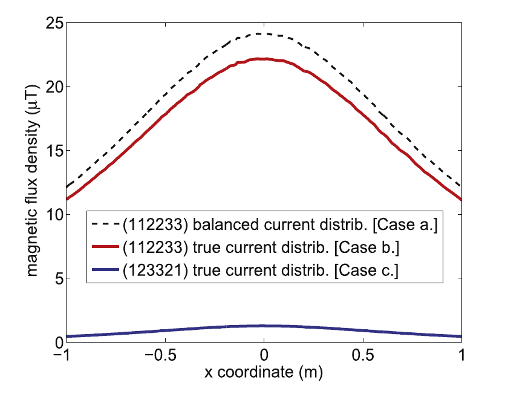
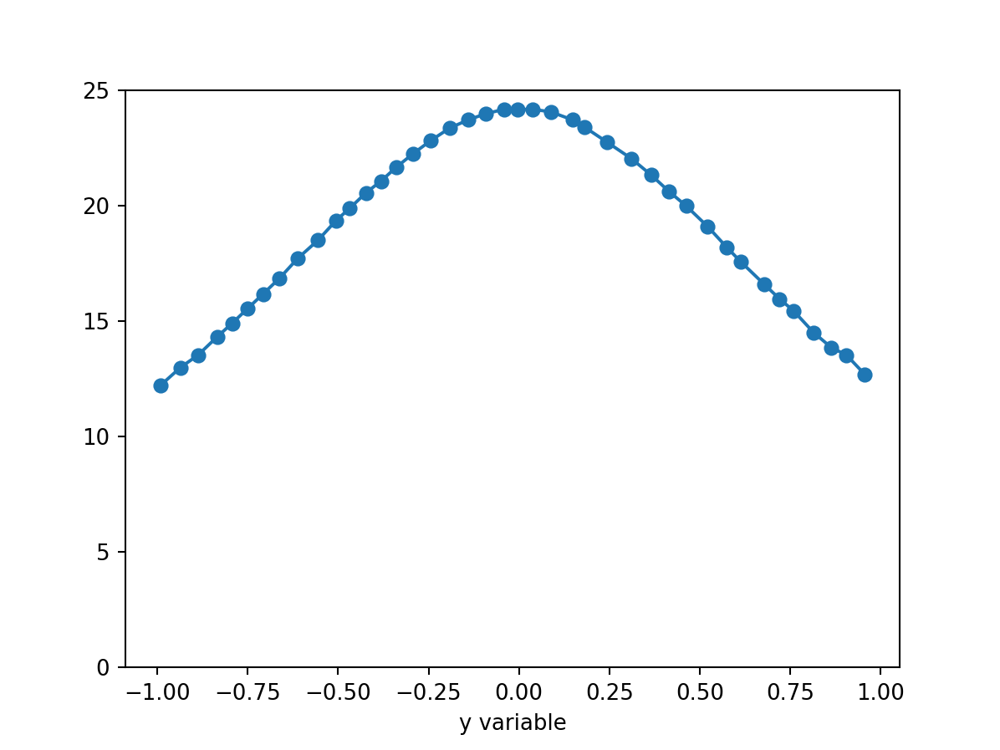

# PyDigitizer
This Python program makes it possible to get samples from a figure. It is useful to extract data from paper for comparison.

## Installation

It is sufficient to clone the repository

```bash
git clone https://github.com/giaccone/PyDigitizer
```

and run `PyDigitizer.py` within an environment with the following requirements:

* pyside2
* matplotlib
* numpy

Finally, Python 3 is required.


## How does it work?

A complete video-tutorial can be found on this [YouTube video](https://youtu.be/CoMeZHTez7c)


To give you an idea, this is the procedure:


* Get an image like the following one:

<p align="center">

</p>
<p align="center">
Example of image - let's suppose we want to extract data of the black dashed curve.
</p>

* Load it into PyDigitizer
* provide some information (X_min, Y_min, X_max, Y_max, axis type, etc)
* pick the data with one of the following methods:
    1. by clicking on the image
    2. by defining a target color
* save the data on a text file


<p align="center">

</p>
<p align="center">
Example of PyDigitizer.py ready for the acquisition
</p>

* use your data to reproduce a high quality plot

<p align="center">

</p>
<p align="center">
Example of plot with the sampled data.
</p>

